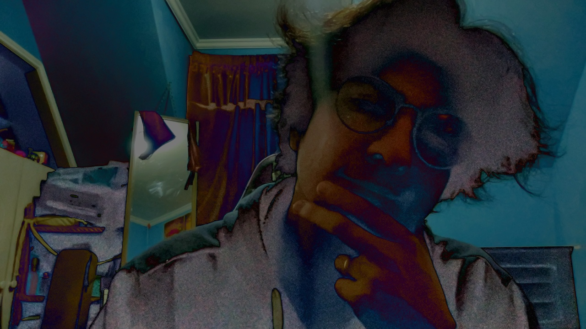

# ImageProy

A sandbox for exploring webcam capture and real-time image processing with Python and OpenCV. The repo is organized in phases (`FaseX/`) that progressively introduce camera concepts — detection, live feed, property control, and multi-camera handling — culminating in `main.py`, a small interactive app.

## main.py

Opens the default camera (index 0) and displays a live feed window with four trackbars and a clickable **SAVE** button overlaid on the frame.

| Control | What it does |
|---|---|
| R / G / B Saturation | Scales the gain of each color channel. 128 = neutral (×1.0). |
| Brightness | Shifts all channels up or down. 128 = neutral (no offset). |
| **[ SAVE ]** button | Captures the current adjusted frame and writes it to `output/capture_<timestamp>.jpg`. |

```bash
python main.py   # press q to quit
```

### Example captures

<table>
<tr>
  <td></td>
  <td></td>
  <td></td>
</tr>
</table>

---

*Personal experiment and sandbox — code generated with the help of AI (Claude).*
